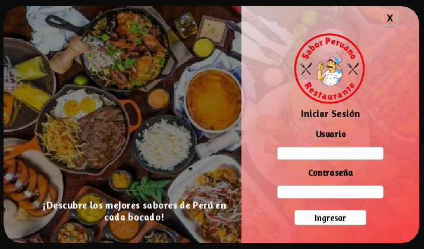
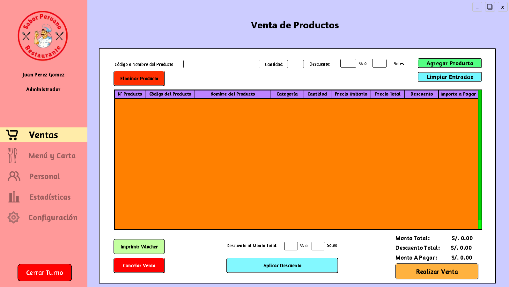
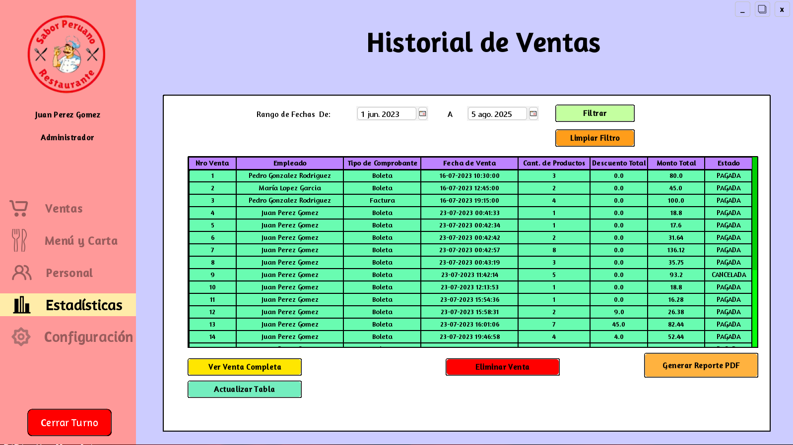
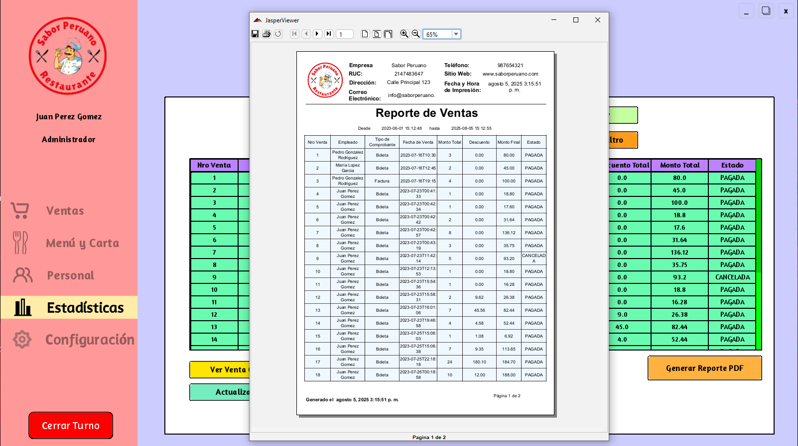

# 🍽️ Sistema de Punto de Venta (POS) de Alto Rendimiento
## **"Sabor Peruano"** - Solución Empresarial Completa

<div align="center">


</div>

---

## 📋 **Descripción del Proyecto**

Una **aplicación de escritorio robusta** desarrollada en **Java SE** con arquitectura **MVC empresarial**, diseñada para digitalizar y optimizar por completo las operaciones de un restaurante, desde la gestión de pedidos hasta la **inteligencia de negocio** avanzada.

### 🎯 **Objetivo Principal**
Transformar la gestión tradicional de restaurantes mediante una solución tecnológica integral que maximice la eficiencia operacional y proporcione insights estratégicos para la toma de decisiones.

---

## 🖼️ **Capturas de Pantalla**

### 🔐 **Sistema de Autenticación Seguro**
*Interfaz de login con validación de credenciales y control de acceso por roles*



### 💰 **Módulo de Ventas Intuitivo**
*Procesamiento rápido de pedidos con interfaz optimizada para alta demanda*



### 📈 **Estadísticas y Reportes**
*Historial de ventas con filtros por rango de fechas y generación de reportes PDF con JasperReports*




---

## ⚡ **Características Principales**

### 🏗️ **Arquitectura Empresarial**
- **Patrón MVC** perfectamente implementado
- **Separación de responsabilidades** con Controllers, DAOs, Models y Views
- **DTOs** para transferencia segura de datos
- **Enums** para tipado fuerte y consistencia de datos

### 🔧 **Funcionalidades Core**
- **🔐 Gestión de Autenticación:** Sistema de login con control de roles y permisos
- **💼 Administración de Personal:** CRUD completo de empleados con diferentes niveles de acceso
- **📋 Gestión de Inventario:** Control de insumos con categorización y alertas de stock
- **🍽️ Administración de Menú:** Gestión dinámica de carta con precios y categorías
- **💰 Módulo de Ventas:** Procesamiento transaccional optimizado para alta concurrencia
- **📊 Business Intelligence:** Reportes detallados con JasperReports y exportación PDF

### 🎨 **Experiencia de Usuario**
- **Interfaz Moderna:** Implementación de FlatLaf para un diseño contemporáneo
- **Componentes Personalizados:** RoundedButton, RoundedTextField para UX superior
- **Navegación Intuitiva:** Diseño centrado en la eficiencia del usuario final
- **Responsive Design:** Adaptable a diferentes resoluciones de pantalla

---

## 🛠️ **Stack Tecnológico**

### **Backend & Core**
- **☕ Java SE 19** - Lenguaje principal con características modernas
- **🏗️ Maven 3.8+** - Gestión de dependencias y construcción del proyecto
- **🗄️ MySQL 8.0+** - Base de datos relacional optimizada
- **🔗 JDBC MySQL Connector 8.0.33** - Conectividad de base de datos

### **Frontend & UI**
- **🖼️ Java Swing** - Framework de interfaz gráfica nativa
- **🎨 FlatLaf 3.1.1** - Look and Feel moderno y profesional
- **📅 JCalendar 1.4** - Componentes de fecha avanzados
- **🔧 SwingX AutoComplete** - Funcionalidades UI extendidas

### **Reportes & Documentos**
- **📊 JasperReports 6.0** - Motor de reportes empresariales (reportes PDF desde filtros de fecha)
- **📄 iText PDF 5.5.13** - Generación de documentos PDF
- **📋 OpenPDF 1.3.30** - Manipulación avanzada de PDFs
- **🌐 Flying Saucer PDF** - Renderizado HTML a PDF

### **Utilidades & Herramientas**
- **⏰ Joda-Time 2.12.5** - Manejo avanzado de fechas y tiempo
- **🔍 JSoup 1.15.4** - Parsing y manipulación HTML
- **📊 Apache Commons** - Librerías de utilidades empresariales

---

## 🧾 **Generación de Reportes con JasperReports**
- Flujo: Selección de rango de fechas → Consulta a MySQL → Llenado del reporte (JasperFillManager) → Visualización (JasperViewer) y/o Exportación a PDF.
- Plantillas: JRXML/Jasper con cabecera de empresa y tabla de ventas (Nro Venta, Empleado, Tipo Comprobante, Fecha, Cantidad, Montos y Estado).
- Botón “Generar Reporte PDF” desde el módulo de Estadísticas.

## 🚀 **Instalación y Configuración**

### **Prerrequisitos**
```bash
- Java JDK 19 o superior
- Maven 3.8+
- MySQL Server 8.0+
- IDE compatible (IntelliJ IDEA, NetBeans, Eclipse)
```

### **1. Configuración de Base de Datos**
```sql
-- Crear base de datos
CREATE DATABASE sabor_peruano_pos;

-- Importar esquema (archivo incluido en el proyecto)
mysql -u root -p sabor_peruano_pos < database/schema.sql
```

### **2. Configuración del Proyecto**
```bash
# Clonar el repositorio
git clone [URL_DEL_REPOSITORIO]

# Navegar al directorio
cd Programa2

# Instalar dependencias
mvn clean install

# Compilar el proyecto
mvn compile
```

### **3. Configuración de Conexión**
Editar el archivo de configuración de base de datos:
```java
// src/main/java/com/saborperuano/sistema/DAO/ConexionBD.java
private static final String URL = "jdbc:mysql://localhost:3306/sabor_peruano_pos";
private static final String USER = "tu_usuario";
private static final String PASSWORD = "tu_contraseña";
```

### **4. Ejecución**
```bash
# Ejecutar desde Maven
mvn exec:java -Dexec.mainClass="com.saborperuano.sistema.LanzadorApp"

# O desde tu IDE favorito
# Ejecutar: com.saborperuano.sistema.LanzadorApp.main()
```

---

## 📁 **Estructura del Proyecto**

```
src/main/java/
├── com/saborperuano/sistema/
│   ├── Controllers/          # Lógica de control MVC
│   ├── DAO/                 # Acceso a datos y conexión BD
│   ├── Interfaces/          # Contratos y abstracciones
│   ├── Models/              # Entidades y DTOs
│   │   ├── DTO/            # Data Transfer Objects
│   │   └── Enums/          # Enumeraciones tipadas
│   ├── Views/              # Interfaces gráficas
│   │   ├── Login/          # Módulo de autenticación
│   │   └── Principal/      # Módulos principales
│   └── LanzadorApp.java    # Punto de entrada
├── utils/                   # Utilidades y helpers
└── resources/              # Recursos estáticos
    ├── fonts/              # Fuentes personalizadas
    ├── img/                # Imágenes e iconos
    └── properties.properties
```

---

## 🔧 **Características Técnicas Avanzadas**

### **Optimizaciones de Rendimiento**
- **Connection Pooling** preparado para implementación
- **Lazy Loading** en consultas de base de datos
- **Caching** de datos frecuentemente accedidos
- **Transacciones optimizadas** para operaciones críticas

### **Seguridad**
- **Validación de entrada** en todos los formularios
- **Sanitización de datos** antes de consultas SQL
- **Control de acceso** basado en roles de usuario
- **Logging de errores** para auditoría y debugging

### **Escalabilidad**
- **Arquitectura modular** para fácil extensión
- **Interfaces bien definidas** para nuevas funcionalidades
- **Separación de concerns** para mantenimiento eficiente
- **Patrón DAO** para abstracción de persistencia

---

## 🤝 **Contribución**

Las contribuciones son bienvenidas. Para contribuir:

1. Fork el proyecto
2. Crea una rama para tu feature (`git checkout -b feature/AmazingFeature`)
3. Commit tus cambios (`git commit -m 'Add some AmazingFeature'`)
4. Push a la rama (`git push origin feature/AmazingFeature`)
5. Abre un Pull Request

---

## 📄 **Licencia**

Este proyecto está bajo la Licencia MIT. Ver el archivo `LICENSE` para más detalles.

---

## 👨‍💻 **Autor**

**Álvaro Correa** - *Desarrollador Full Stack*
- 💼 LinkedIn: www.linkedin.com/in/alvarocorreagastelo
- 📧 Email: acorreag19@hotmail.com
---

<div align="center">

### ⭐ **Si este proyecto te resulta útil, no olvides darle una estrella!** ⭐

**Desarrollado con ❤️ para la digitalización de restaurantes**

</div>
